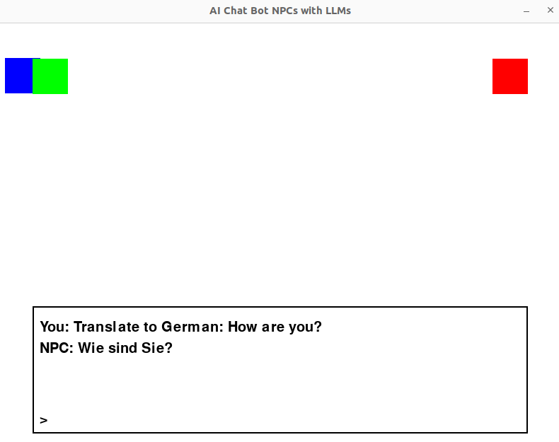
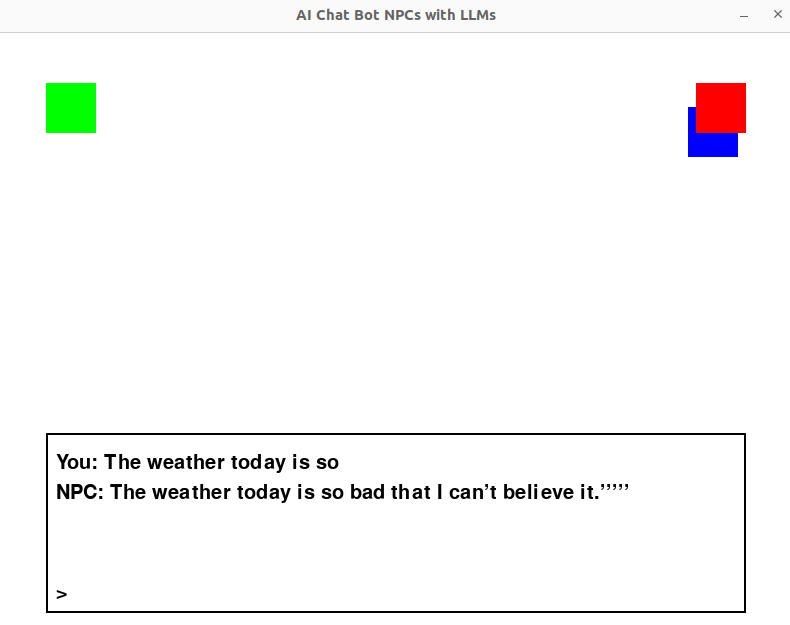

# Game_chatbots

This is a simple template for creating a LLM Agents based game. 
There is a single player that interacts with 2 seperate game individuals(each running on a seperate LLM).

## Setup:


### Install Conda and update packages:

```bash
curl -O https://repo.anaconda.com/miniconda/Miniconda3-latest-Linux-x86_64.sh
sh Miniconda3-latest-Linux-x86_64.sh
eval "$((CONDA_DIRECTORY)/bin/conda shell.bash hook)"
conda create -n game python=3.8 numpy pandas
conda activate game
pip install pygame transformers
pip3 install torch torchvision torchaudio --index-url https://download.pytorch.org/whl/cpu
conda install -c conda-forge libstdcxx-ng
```

### Install some additional packages

```bash
sudo apt install libgl1-mesa-glx libgl1-mesa-dri mesa-utils libgl1-mesa-swx11 mesa-va-drivers mesa-vdpau-drivers libglu1-mesa
sudo mkdir -p /usr/lib/dri
sudo find / -name swrast_dri.so
sudo ln -s /usr/lib/x86_64-linux-gnu/dri/swrast_dri.so /usr/lib/dri/swrast_dri.so
```

## Run the template
```bash
LIBGL_ALWAYS_SOFTWARE=1 python game.py
```

You can move the player(box) with the arrow keys and when you touch the other player(box), you can initaite a talk by pressing 'E'
End the talk by pressing 'ESC'

### Sample output

Sample output from Flan-T5-LLM game player



Sample output from Distill-GPT2-LLM game player

